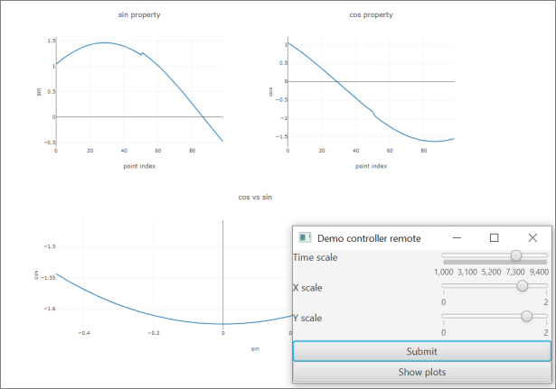

# Controls.kt

Controls.kt (former DataForge-control) is a data acquisition framework (work in progress). It is based on DataForge, a software framework for automated data processing.
This repository contains a prototype of API and simple implementation
of a slow control system, including a demo.

Controls.kt uses some concepts and modules of DataForge,
such as `Meta` (tree-like value structure).

To learn more about DataForge, please consult the following URLs:
* [Kotlin multiplatform implementation of DataForge](https://github.com/mipt-npm/dataforge-core)
* [DataForge documentation](http://npm.mipt.ru/dataforge/)
* [Original implementation of DataForge](https://bitbucket.org/Altavir/dataforge/src/default/)

DataForge-control is a [Kotlin-multiplatform](https://kotlinlang.org/docs/reference/multiplatform.html)
application. Asynchronous operations are implemented with
[kotlinx.coroutines](https://github.com/Kotlin/kotlinx.coroutines) library.

## Materials and publications

* Video - [A general overview seminar](https://youtu.be/LO-qjWgXMWc)
* Video - [A seminar about the system mechanics](https://youtu.be/wES0RV5GpoQ)
* Article - [A Novel Solution for Controlling Hardware Components of Accelerators and Beamlines](https://www.preprints.org/manuscript/202108.0336/v1)

### Features
Among other things, you can:
- Describe devices and their properties.
- Collect data from devices and execute arbitrary actions supported by a device.
- Property values can be cached in the system and requested from devices as needed, asynchronously.
- Connect devices to event bus via bidirectional message flows.

Example view of a demo:

## Documentation

* [Creating a device](docs/Device%20and%20DeviceSpec.md)

## Modules

### [controls-constructor](controls-constructor)
> A low-code constructor for composite devices simulation
>
> **Maturity**: PROTOTYPE

### [controls-core](controls-core)
> Core interfaces for building a device server
>
> **Maturity**: EXPERIMENTAL
>
> **Features:**
> - [device](controls-core/src/commonMain/kotlin/space/kscience/controls/api/Device.kt) : Device API with subscription (asynchronous and pseudo-synchronous properties)
> - [deviceMessage](controls-core/src/commonMain/kotlin/space/kscience/controls/api/DeviceMessage.kt) : Specification for messages used to communicate between Controls-kt devices.
> - [deviceHub](controls-core/src/commonMain/kotlin/space/kscience/controls/api/DeviceHub.kt) : Grouping of devices into local tree-like hubs.
> - [deviceSpec](controls-core/src/commonMain/kotlin/space/kscience/controls/spec) : Mechanics and type-safe builders for devices. Including separation of device specification and device state.
> - [deviceManager](controls-core/src/commonMain/kotlin/space/kscience/controls/manager) : DataForge DI integration for devices. Includes device builders.
> - [ports](controls-core/src/commonMain/kotlin/space/kscience/controls/ports) : Working with asynchronous data sending and receiving raw byte arrays

### [controls-jupyter](controls-jupyter)
>
> **Maturity**: EXPERIMENTAL

### [controls-magix](controls-magix)
> Magix service for binding controls devices (both as RPC client and server)
>
> **Maturity**: EXPERIMENTAL
>
> **Features:**
> - [controlsMagix](controls-magix/src/commonMain/kotlin/space/kscience/controls/client/controlsMagix.kt) : Connect a `DeviceManage` with one or many devices to the Magix endpoint
> - [DeviceClient](controls-magix/src/commonMain/kotlin/space/kscience/controls/client/DeviceClient.kt) : A remote connector to Controls-kt device via Magix

### [controls-modbus](controls-modbus)
> A plugin for Controls-kt device server on top of modbus-rtu/modbus-tcp protocols
>
> **Maturity**: EXPERIMENTAL
>
> **Features:**
> - [modbusRegistryMap](controls-modbus/src/main/kotlin/space/kscience/controls/modbus/ModbusRegistryMap.kt) : Type-safe modbus registry map. Allows to define both single-register and multi-register entries (using DataForge IO). 
Automatically checks consistency.
> - [modbusProcessImage](controls-modbus/src/main/kotlin/space/kscience/controls/modbus/DeviceProcessImage.kt) : Binding of slave (server) modbus device to Controls-kt device
> - [modbusDevice](controls-modbus/src/main/kotlin/space/kscience/controls/modbus/ModbusDevice.kt) : A device with additional methods to work with modbus registers.

### [controls-opcua](controls-opcua)
> A client and server connectors for OPC-UA via Eclipse Milo
>
> **Maturity**: EXPERIMENTAL
>
> **Features:**
> - [opcuaClient](controls-opcua/src/main/kotlin/space/kscience/controls/opcua/client) : Connect a Controls-kt as a client to OPC UA server
> - [opcuaServer](controls-opcua/src/main/kotlin/space/kscience/controls/opcua/server) : Create an OPC UA server on top of Controls-kt device (or device hub)

### [controls-pi](controls-pi)
> Utils to work with controls-kt on Raspberry pi
>
> **Maturity**: EXPERIMENTAL

### [controls-ports-ktor](controls-ports-ktor)
> Implementation of byte ports on top os ktor-io asynchronous API
>
> **Maturity**: PROTOTYPE

### [controls-serial](controls-serial)
> Implementation of direct serial port communication with JSerialComm
>
> **Maturity**: EXPERIMENTAL

### [controls-server](controls-server)
> A combined Magix event loop server with web server for visualization.
>
> **Maturity**: PROTOTYPE

### [controls-storage](controls-storage)
> An API for stand-alone Controls-kt device or a hub.
>
> **Maturity**: PROTOTYPE

### [controls-vision](controls-vision)
> Dashboard and visualization extensions for devices
>
> **Maturity**: PROTOTYPE

### [demo](demo)
>
> **Maturity**: EXPERIMENTAL

### [magix](magix)
>
> **Maturity**: EXPERIMENTAL

### [controls-storage/controls-xodus](controls-storage/controls-xodus)
> An implementation of controls-storage on top of JetBrains Xodus.
>
> **Maturity**: PROTOTYPE

### [demo/all-things](demo/all-things)
>
> **Maturity**: EXPERIMENTAL

### [demo/car](demo/car)
>
> **Maturity**: EXPERIMENTAL

### [demo/constructor](demo/constructor)
>
> **Maturity**: EXPERIMENTAL

### [demo/echo](demo/echo)
>
> **Maturity**: EXPERIMENTAL

### [demo/magix-demo](demo/magix-demo)
>
> **Maturity**: EXPERIMENTAL

### [demo/many-devices](demo/many-devices)
>
> **Maturity**: EXPERIMENTAL

### [demo/mks-pdr900](demo/mks-pdr900)
>
> **Maturity**: EXPERIMENTAL

### [demo/motors](demo/motors)
>
> **Maturity**: EXPERIMENTAL

### [magix/magix-api](magix/magix-api)
> A kotlin API for magix standard and some zero-dependency magix services
>
> **Maturity**: EXPERIMENTAL

### [magix/magix-java-endpoint](magix/magix-java-endpoint)
> Java API to work with magix endpoints without Kotlin
>
> **Maturity**: EXPERIMENTAL

### [magix/magix-mqtt](magix/magix-mqtt)
> MQTT client magix endpoint
>
> **Maturity**: PROTOTYPE

### [magix/magix-rabbit](magix/magix-rabbit)
> RabbitMQ client magix endpoint
>
> **Maturity**: PROTOTYPE

### [magix/magix-rsocket](magix/magix-rsocket)
> Magix endpoint (client) based on RSocket
>
> **Maturity**: EXPERIMENTAL

### [magix/magix-server](magix/magix-server)
> A magix event loop implementation in Kotlin. Includes HTTP/SSE and RSocket routes.
>
> **Maturity**: EXPERIMENTAL

### [magix/magix-storage](magix/magix-storage)
> Magix history database API
>
> **Maturity**: PROTOTYPE

### [magix/magix-zmq](magix/magix-zmq)
> ZMQ client endpoint for Magix
>
> **Maturity**: EXPERIMENTAL

### [magix/magix-storage/magix-storage-xodus](magix/magix-storage/magix-storage-xodus)
>
> **Maturity**: PROTOTYPE

### `demo` module

The demo includes a simple mock device with a few properties changing as `sin` and `cos` of
the current time. The device is configurable via a simple TornadoFX-based control panel.
You can run a demo by executing `application/run` Gradle task.

The graphs are displayed using [plotly.kt](https://github.com/mipt-npm/plotly.kt) library.
