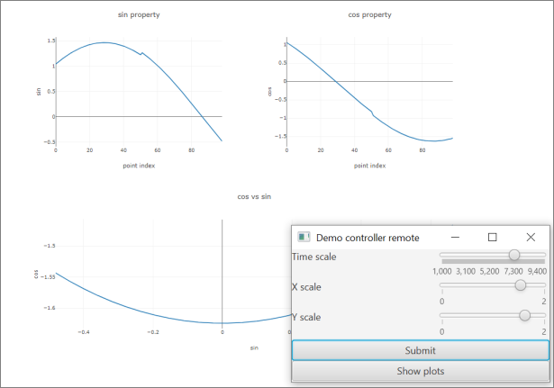

# Controls.kt

Controls.kt (former DataForge-control) is a data acquisition framework (work in progress). It is based on DataForge, a software framework for automated data processing.
This repository contains a prototype of API and simple implementation
of a slow control system, including a demo.

Controls.kt uses some concepts and modules of DataForge,
such as `Meta` (tree-like value structure).

To learn more about DataForge, please consult the following URLs:
* [Kotlin multiplatform implementation of DataForge](https://github.com/mipt-npm/dataforge-core)
* [DataForge documentation](http://npm.mipt.ru/dataforge/)
* [Original implementation of DataForge](https://bitbucket.org/Altavir/dataforge/src/default/)

DataForge-control is a [Kotlin-multiplatform](https://kotlinlang.org/docs/reference/multiplatform.html)
application. Asynchronous operations are implemented with
[kotlinx.coroutines](https://github.com/Kotlin/kotlinx.coroutines) library.

## Materials and publications

* Video - [A general overview seminar](https://youtu.be/LO-qjWgXMWc)
* Video - [A seminar about the system mechanics](https://youtu.be/wES0RV5GpoQ)
* Article - [A Novel Solution for Controlling Hardware Components of Accelerators and Beamlines](https://www.preprints.org/manuscript/202108.0336/v1)

### Features
Among other things, you can:
- Describe devices and their properties.
- Collect data from devices and execute arbitrary actions supported by a device.
- Property values can be cached in the system and requested from devices as needed, asynchronously.
- Connect devices to event bus via bidirectional message flows.

Example view of a demo:

## Documentation

* [Creating a device](docs/Device%20and%20DeviceSpec.md)

## Modules

### [controls-constructor](controls-constructor)
> A low-code constructor for composite devices simulation
>
> **Maturity**: EXPERIMENTAL
>
> **Features:**
> - [constructor](controls-constructor/src/commonMain/kotlin/space/kscience/controls/constructor/Constructor.kt) : A low-code DSL for composing complex devices and simulations from basic components and models.
> - [valueState](controls-constructor/src/commonMain/kotlin/space/kscience/controls/constructor/ValueState.kt) : Reactive state containers used to represent device properties, internal variables, and simulation parameters.
> - [models](controls-constructor/src/commonMain/kotlin/space/kscience/controls/constructor/models) : A library of physical and logical models, including PID regulators, inertia, and mechanical components.
> - [flowModels](controls-constructor/src/commonMain/kotlin/space/kscience/controls/constructor/models/continuous) : Simulation models for continuous and discrete flows of material, energy, or information.
> - [simulatedDevices](controls-constructor/src/commonMain/kotlin/space/kscience/controls/constructor/devices) : Pre-defined simulated devices like drives, encoders, and limit switches ready to be used in constructions.
> - [expressions](controls-constructor/src/commonMain/kotlin/space/kscience/controls/constructor/expressions) : A type-safe DSL for creating reactive expressions and bindings between different states.
> - [units](controls-constructor/src/commonMain/kotlin/space/kscience/controls/constructor/units) : Support for physical quantities and units of measurement in simulations and device properties.

### [controls-core](controls-core)
> Core interfaces for building a device server
>
> **Maturity**: EXPERIMENTAL
>
> **Features:**
> - [device](controls-core/src/commonMain/kotlin/space/kscience/controls/api/Device.kt) : Device API with subscription (asynchronous and pseudo-synchronous properties)
> - [deviceMessage](controls-core/src/commonMain/kotlin/space/kscience/controls/api/DeviceMessage.kt) : Specification for messages used to communicate between Controls-kt devices.
> - [deviceHub](controls-core/src/commonMain/kotlin/space/kscience/controls/api/DeviceHub.kt) : Grouping of devices into local tree-like hubs.
> - [deviceSpec](controls-core/src/commonMain/kotlin/space/kscience/controls/spec) : Mechanics and type-safe builders for devices. Including separation of device specification and device state.
> - [deviceManager](controls-core/src/commonMain/kotlin/space/kscience/controls/manager) : DataForge DI integration for devices. Includes device builders.
> - [ports](controls-core/src/commonMain/kotlin/space/kscience/controls/ports) : Working with asynchronous data sending and receiving raw byte arrays
> - [clock](controls-core/src/commonMain/kotlin/space/kscience/controls/time) : Clock management and time manipulation (virtual and compressed time)

### [controls-jupyter](controls-jupyter)
>
> **Maturity**: EXPERIMENTAL

### [controls-magix](controls-magix)
> Magix service for binding controls devices (both as RPC client and server)
>
> **Maturity**: EXPERIMENTAL
>
> **Features:**
> - [magixService](controls-magix/src/commonMain/kotlin/space/kscience/controls/client/controlsMagix.kt) : Connect a `DeviceManager` with one or many devices to the Magix endpoint
> - [deviceClient](controls-magix/src/commonMain/kotlin/space/kscience/controls/client/DeviceClient.kt) : A remote connector to Controls-kt device via Magix

### [controls-modbus](controls-modbus)
> A plugin for Controls-kt device server on top of modbus-rtu/modbus-tcp protocols
>
> **Maturity**: EXPERIMENTAL
>
> **Features:**
> - [modbusRegistryMap](controls-modbus/src/main/kotlin/space/kscience/controls/modbus/ModbusRegistryMap.kt) : Type-safe modbus registry map. Allows to define both single-register and multi-register entries (using DataForge IO). 
Automatically checks consistency.
> - [modbusProcessImage](controls-modbus/src/main/kotlin/space/kscience/controls/modbus/DeviceProcessImage.kt) : Binding of slave (server) modbus device to Controls-kt device
> - [modbusDevice](controls-modbus/src/main/kotlin/space/kscience/controls/modbus/ModbusDevice.kt) : A device with additional methods to work with modbus registers.

### [controls-opcua](controls-opcua)
> A client and server connectors for OPC-UA via Eclipse Milo
>
> **Maturity**: EXPERIMENTAL
>
> **Features:**
> - [opcuaClient](controls-opcua/src/main/kotlin/space/kscience/controls/opcua/client) : Connect a Controls-kt as a client to OPC UA server
> - [opcuaServer](controls-opcua/src/main/kotlin/space/kscience/controls/opcua/server) : Create an OPC UA server on top of Controls-kt device (or device hub)

### [controls-pi](controls-pi)
> Utils to work with controls-kt on Raspberry pi
>
> **Maturity**: EXPERIMENTAL

### [controls-plc-emulator](controls-plc-emulator)
> An interpreter for IEC 61131-3 PLC programs. It includes a parser for Instruction List (IL), 
a compiler for Structured Text (ST), and a runtime for executing IL programs.
>
> **Maturity**: PROTOTYPE
>
> **Features:**
> - [ILRuntime](controls-plc-emulator/src/commonMain/kotlin/space/kscience/controls/plcemu/IlRuntime.kt) : A runtime for the IEC 61131-3 Instruction List (IL) language.
> - [STCompiler](controls-plc-emulator/src/commonMain/kotlin/space/kscience/controls/plcemu/StCompiler.kt) : A compiler for the IEC 61131-3 Structured Text (ST) language.
> - [ILParser](controls-plc-emulator/src/commonMain/kotlin/space/kscience/controls/plcemu/IlParser.kt) : A parser for the IEC 61131-3 Instruction List (IL) language based on the Parsus library.
> - [PlcState](controls-plc-emulator/src/commonMain/kotlin/space/kscience/controls/plcemu/PlcState.kt) : A state interface for the PLC emulator, allowing interaction with registers and external values.

### [controls-plc4x](controls-plc4x)
> A plugin for Controls-kt device server on top of plc4x library
>
> **Maturity**: EXPERIMENTAL

### [controls-ports-ktor](controls-ports-ktor)
> Implementation of byte ports on top os ktor-io asynchronous API
>
> **Maturity**: PROTOTYPE

### [controls-serial](controls-serial)
> Implementation of direct serial port communication with JSerialComm
>
> **Maturity**: EXPERIMENTAL

### [controls-server](controls-server)
> A combined Magix event loop server with web server for visualization.
>
> **Maturity**: PROTOTYPE

### [controls-storage](controls-storage)
> An API for stand-alone Controls-kt device or a hub.
>
> **Maturity**: PROTOTYPE

### [controls-table](controls-table)
> Device timed data platform
>
> **Maturity**: EXPERIMENTAL

### [controls-vision](controls-vision)
> Dashboard and visualization extensions for devices
>
> **Maturity**: PROTOTYPE

### [controls-visualisation-compose](controls-visualisation-compose)
> Visualisation extension using compose-multiplatform
>
> **Maturity**: PROTOTYPE

### [simulation-kt](simulation-kt)
> A framework for combination of asynchronous simulations.        
>
> **Maturity**: PROTOTYPE
>
> **Features:**
> - [timeline](simulation-kt/#) : Timeline is an ordered discrete history containing TimeLineEvent

### [controls-models/controls-models-flow](controls-models/controls-models-flow)
> Models for continuous and discrete flow systems
>
> **Maturity**: EXPERIMENTAL

### [controls-models/controls-models-mechanical](controls-models/controls-models-mechanical)
> Models for mechanical devices
>
> **Maturity**: EXPERIMENTAL

### [controls-storage/controls-exposed](controls-storage/controls-exposed)
> An implementation of controls-storage on top of JetBrains Exposed JDBC.
>
> **Maturity**: PROTOTYPE

### [controls-storage/controls-xodus](controls-storage/controls-xodus)
> An implementation of controls-storage on top of JetBrains Xodus.
>
> **Maturity**: PROTOTYPE

### [demo/constructor](demo/constructor)
>
> **Maturity**: EXPERIMENTAL

### [demo/device-collective](demo/device-collective)
>
> **Maturity**: EXPERIMENTAL

### [demo/magix-demo](demo/magix-demo)
>
> **Maturity**: EXPERIMENTAL

### [demo/motors](demo/motors)
>
> **Maturity**: EXPERIMENTAL

### [demo/thermo](demo/thermo)
>
> **Maturity**: EXPERIMENTAL

### [magix/magix-api](magix/magix-api)
> A kotlin API for magix standard and some zero-dependency magix services
>
> **Maturity**: EXPERIMENTAL

### [magix/magix-java-endpoint](magix/magix-java-endpoint)
> Java API to work with magix endpoints without Kotlin
>
> **Maturity**: EXPERIMENTAL

### [magix/magix-mqtt](magix/magix-mqtt)
> MQTT client magix endpoint
>
> **Maturity**: PROTOTYPE

### [magix/magix-rabbit](magix/magix-rabbit)
> RabbitMQ client magix endpoint
>
> **Maturity**: PROTOTYPE

### [magix/magix-rsocket](magix/magix-rsocket)
> Magix endpoint (client) based on RSocket
>
> **Maturity**: EXPERIMENTAL

### [magix/magix-server](magix/magix-server)
> A magix event loop implementation in Kotlin. Includes HTTP/SSE and RSocket routes.
>
> **Maturity**: EXPERIMENTAL

### [magix/magix-storage](magix/magix-storage)
> Magix history database API
>
> **Maturity**: PROTOTYPE

### [magix/magix-utils](magix/magix-utils)
> Common utilities and services for Magix endpoints.   
>
> **Maturity**: EXPERIMENTAL

### [magix/magix-zmq](magix/magix-zmq)
> ZMQ client endpoint for Magix
>
> **Maturity**: EXPERIMENTAL

### [magix/magix-storage/magix-storage-xodus](magix/magix-storage/magix-storage-xodus)
>
> **Maturity**: PROTOTYPE

### `demo` module

The demo includes a simple mock device with a few properties changing as `sin` and `cos` of
the current time. The device is configurable via a simple TornadoFX-based control panel.
You can run a demo by executing `application/run` Gradle task.

The graphs are displayed using [plotly.kt](https://github.com/mipt-npm/plotly.kt) library.
