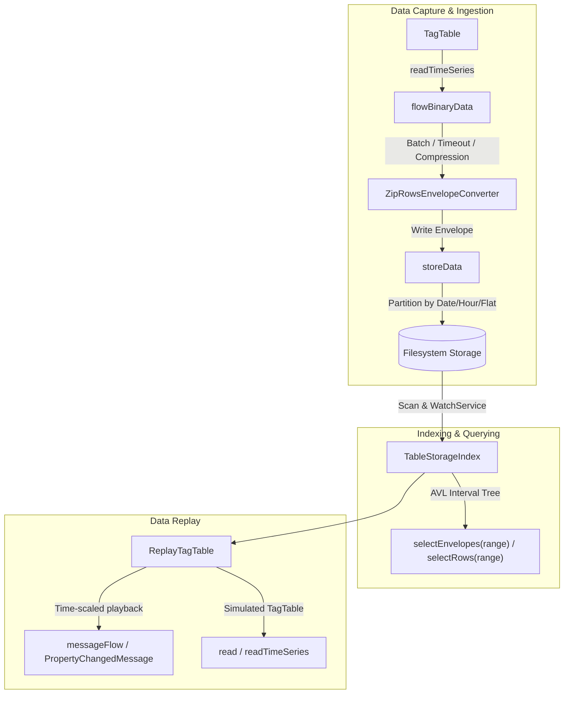

# Tag Table Data Storage and Reading

The `controls-table` module provides a high-throughput, interval-indexed storage system for time-series data captured from tag tables and industrial devices.

Data is partitioned into self-describing binary envelopes (e.g., zip-compressed tables) containing blocks of rows stamped with start and end timestamps. An in-memory AVL interval tree indexes these envelopes for fast time-range queries, streaming replay, and real-time directory synchronization.

---

## Architecture Overview



---

## 1. Storing Tag Table Data

### `TagTable.flowBinaryData`

The `flowBinaryData` extension converts continuous time-series rows into a Kotlin coroutine `Flow<Envelope>` containing batch-encoded rows:

```kotlin
public fun TagTable.flowBinaryData(
    readInterval: Duration,
    converter: RowsEnvelopeConverter<Meta>,
    maxRows: Int = 10000,
    maxDuration: Duration = 3.hours,
    maxPause: Duration? = null,
    compression: RowsCompression? = null,
): Flow<Envelope>
```

#### Envelope Flushing Triggers
Envelopes are flushed and emitted downstream whenever any of the following conditions is met:
1. **Row Count Threshold**: The number of buffered rows reaches `maxRows` (default: 10,000).
2. **Maximum Duration**: The duration since the start of the current collection exceeds `maxDuration` (default: 3 hours).
3. **Max Pause Timeout**: When `maxPause` is specified, an envelope is automatically flushed if no new rows have been received for `maxPause` duration.

#### Compression Integration
When `RowsCompression` is applied (filtering unchanged rows or columns within numeric deltas), `flowBinaryData` automatically injects a full baseline row with all current tag values (`readAll()`) at the start of each new envelope block. This guarantees that decompressed blocks remain self-contained without missing initial values.

#### Envelope Metadata
Each envelope metadata is populated according to `RowEnvelopeMetaSpec`:
- `startTime`: Timestamp (`Instant`) of the first row in the envelope.
- `endTime`: Timestamp (`Instant`) of the last row in the envelope.
- `numberOfRows`: Total number of rows in the envelope.
- `readInterval`, `maxRows`, `maxDuration`: Batching configuration parameters.
- `timeSerriesCompression`: Applied compression configuration meta (if any).

---

### `TagTable.storeData`

`storeData` consumes the envelope flow and persists envelope files to disk using configurable partitioning strategies:

```kotlin
public fun TagTable.storeData(
    directory: Path,
    readInterval: Duration,
    maxRowsPerEnvelope: Int = 10000,
    maxDuration: Duration = 3.hours,
    maxPause: Duration? = null,
    compression: RowsCompression? = null,
    operations: FileEnvelopeOperations = NativeFileEnvelopeOperations(context.io),
    strategy: DataPlatformFileSplit = DataPlatformFileSplit.ByDate(),
    rowsConverter: RowsEnvelopeConverter<Meta> = ZipRowsEnvelopeConverter.meta,
    clock: Clock = context.clock,
): Job
```

#### Directory Partitioning Strategies (`DataPlatformFileSplit`)
- `DataPlatformFileSplit.Flat`: Stores all envelope files directly in `directory`.
- `DataPlatformFileSplit.ByDate(timeZoneId)` *(default)*: Partitions files into `YYYY/MM/DD` subdirectories based on envelope timestamp.
- `DataPlatformFileSplit.ByHour(timeZoneId)`: Partitions files into `YYYY/MM/DD/HH` subdirectories.

---

## 2. Indexing and Querying (`TableStorageIndex`)

`TableStorageIndex` manages, queries, and monitors stored interval envelopes within a target data directory.

```kotlin
val index = TableStorageIndex(
    storage = storagePlugin,
    dataDirectory = path,
    cacheMetadata = true,
    removeFilesCycleDuration = 10.minutes
)
index.start()
```

### In-Memory AVL Interval Tree
`TableStorageIndex` indexes envelope intervals `[startTime, endTime]` in an augmented **AVL tree**:
- Each node stores an interval and tracks the subtree maximum endpoint `maxEnd`.
- Provides $O(\log N + K)$ time complexity for intersecting interval lookups over $N$ stored files returning $K$ results.

### Real-Time Directory Monitoring and Synchronization
- **Initial Indexing**: During `start()`, all existing envelope files in `dataDirectory` (recursively) are scanned and inserted into the interval tree.
- **Dynamic File Creation**: Uses Java `WatchService` via `launchDirectoryMonitor` to listen for `ENTRY_CREATE` events in real time and incrementally insert new envelopes into the tree.
- **Safe Deletion Handling**: Tracks `ENTRY_DELETE` events and periodically cleans up deleted files from the AVL tree at intervals specified by `removeFilesCycleDuration` (default: 10 minutes).

### Querying Data

#### Intersecting Envelopes
Retrieves all envelope containers whose time interval overlaps with `range`:
```kotlin
val envelopes: List<Envelope> = index.selectEnvelopes(startTime..endTime)
```

#### Consolidated Rows
Retrieves and flattens rows across matching envelope blocks into a unified `Rows<Meta>` table sequence, sorted by time and filtered strictly within `range`:
```kotlin
val rows: Rows<Meta> = index.selectRows(startTime..endTime)
rows.rowSequence().forEach { row ->
    val time = row[TagTable.timeColumnHeader].instant
    val value = row["temperature"]
}
```

---

## 3. Replaying Historical Data (`ReplayTagTable`)

`ReplayTagTable` exposes stored historical data as a virtual, live `TagTable` implementing the `Replay` interface.

```kotlin
val replayTable = TagTable.replay(
    storage = storagePlugin,
    dataDirectory = storagePath,
    tags = tagDescriptors
)
```

### Features

- **Time-Scaled Playback**:
  ```kotlin
  val playJob = replayTable.play(
      from = startInstant,
      to = endInstant,
      startTime = null, // null = start playing from current clock time
      timeScale = 2.0   // 2x speed playback
  )
  ```
- **Live Device Message Stream**: Emits `PropertyChangedMessage` for individual tags and composite `TagTable.ROW_PROPERTY_NAME` updates to `messageFlow` matching recorded time deltas.
- **Synchronous and Time-Series Reads**: Implements `read(tag)`, `readAll()`, and `readTimeSeries(interval)` backed by current replay state.
- **Value State Observation**: Supports observable properties via `valueState(tag)`.


---

## Complete Example

```kotlin
// 1. Configure storage plugin in DataForge Context
val context = Context("storage-example") {
    plugin(ControlsStoragePlugin)
}
val storagePlugin = context.request(ControlsStoragePlugin)
val dataDir = Path("data/storage")

// 2. Start capturing and storing data from an active TagTable
val storageJob = tagTable.storeData(
    directory = dataDir,
    readInterval = 100.milliseconds,
    maxRowsPerEnvelope = 1000,
    strategy = DataPlatformFileSplit.ByDate()
)

// ... Collect data ...

// 3. Query historical data via TableStorageIndex
val index = TableStorageIndex(storagePlugin, dataDir)
index.start()

val from = Clock.System.now() - 1.hours
val to = Clock.System.now()
val historicalRows = index.selectRows(from..to)

// 4. Replay historical data at 1x speed
val replayTable = ReplayTagTable(index, tagTable.tags)
val playbackJob = replayTable.play(from = from, to = to, timeScale = 1.0)
```
