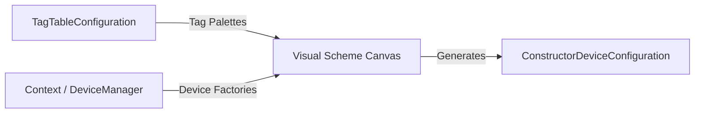
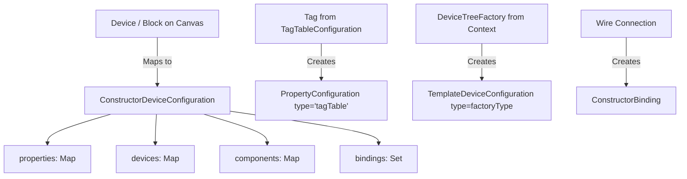

# UI Specification for Device Scheme Visual Configurator

This document specifies the requirements and architecture for a Compose Multiplatform-based visual tool that enables users to visually design, configure, and wire device schemes represented as `ConstructorDeviceConfiguration`.

This specification must be updated when some changes are required for configuration UI. Updated must be annotated by the dates they are made and change the request summary.

## 1. Overview and Architecture

The **Visual Device Configurator** is designed to construct, edit, and export hierarchical device topologies serialized as `ConstructorDeviceConfiguration`. It provides an intuitive node-and-wire visual design canvas where users configure device blocks, declare properties, map physical inputs from `TagTableConfiguration`, instantiate template devices from registered `DeviceTreeFactory` plugins, and define inter-device bindings.



---

## 2. UI Layout & Core Components

The UI interface is structured into four main operational areas:

```
+----------------------------------------------------------------------------------------------------+
|  Toolbar: [Load TagTable] [Load Config] [Save/Export JSON] [Validate] [Auto-Layout] [Zoom: 100%]   |
+----------------------+----------------------------------------------+------------------------------+
| Left Sidebar Palette | Central Canvas                               | Right Inspector Panel        |
| - Tag Sources Table  |  +--------------------+   +---------------+  | Selected Item:               |
|   * OPC UA Nodes     |  | Device Block: part0|   | Virtual/Tmpl  |  | - Block / Device Name        |
|   * Modbus Registers |  | - Prop: temp (Tag) |---> In: alarmIn    |  | - Meta Parameters (Form)     |
|   * PLC4X Addresses  |  | - Prop: sum (Expr) |   | Device: Alarm |  | - Target Input / Defaults    |
| - Device Factories   |  +--------------------+   +---------------+  | - Validation & Errors        |
|   * Alarm, PID, etc. |                                              |                              |
+----------------------+----------------------------------------------+------------------------------+
| Bottom Panel: Diagnostics / Validation Messages / JSON Preview                                    |
+----------------------------------------------------------------------------------------------------+
```

### 2.1. Top Navigation Toolbar
* **Action Buttons**: `Import TagTable`, `Open Device Scheme`, `Export Scheme (JSON)`, `Auto-Layout Graph`, `Zoom to Fit`.
* **Validation Indicator**: Real-time status badge displaying binding integrity, unresolved device names, or mismatched parameter descriptors.
* **Mode Toggle**: Switch between **Edit Mode** (full schema modification) and **Preview Mode** (read-only live simulation if attached to an active `Context`).

### 2.2. Left Sidebar (Asset & Palette Browser)
* **Tag Explorer Tab (`TagTableConfiguration`)**:
  * Hierarchical tree grouping tags by `source` (e.g., OPC UA servers, Modbus controllers, PLC4X endpoints).
  * Search/filter box by tag name, address, or metadata keywords.
  * Draggable tag items that can be dropped directly onto device blocks to create tag-bound properties.
* **Device Factory Library Tab**:
  * Dynamically discovered list of `DeviceTreeFactory` and `DeviceFactory` implementations retrieved from `DeviceManager.factories` via context queries (`context.gather(DeviceManager.DEVICE_FACTORY_TARGET, DeviceTreeFactory::class)`).
  * Filterable catalog displaying factory names, descriptions, and icon badges.
  * Draggable factory items for dropping into the canvas to instantiate `TemplateDeviceConfiguration` nodes.
* **Value State Factory Library Tab**:
  * Available `ValueStateFactory` options (e.g., `deviceProperty`, `expression`, `tagTable`, `timer`).

### 2.3. Central Scheme Canvas
* Infinite pan/zoomable graph workspace supporting multi-selection, drag-and-drop, snapping grid, and collision avoidance.
* Visual representations for:
  * **Device Containers (`ConstructorDeviceConfiguration`)**: Nested or grouped bounding boxes representing root or sub-devices.
  * **Device Blocks**: Rectangular nodes featuring header (device name, type/icon) and an expandable list of properties (output ports) and bound inputs (input ports).
  * **Template / Virtual Device Blocks (`TemplateDeviceConfiguration`)**: Distinct visual styling (e.g., dashed border or distinctive color accent) indicating factory-instantiated components.
  * **Binding Connections (`ConstructorBinding`)**: Directional bezier curves / orthogonal lines connecting source property ports to target device input ports.

### 2.4. Right Inspector Panel
* **Context-Aware Property Editor**:
  * **Device Block Selected**: Edit device `name`, sub-device hierarchies, and arbitrary metadata entries in `parameters` / `metadata`.
  * **Property Selected**: Edit property `name`, select `ValueStateFactory` type, configure parameters (e.g., mathematical expression string or tag reference).
  * **Template Device Selected**: Dynamically generated input form based on the factory's `MetaDescriptor` (validating schema types, numeric ranges, default values, and unit specifications).
  * **Binding Wire Selected**: Configure `sourceDevice`, `sourceProperty`, `targetDevice`, `targetInput` (defaulting to `DEFAULT_INPUT_NAME`), and `defaultValue`.

---

## 3. Data Model Mapping & Binding Semantics

The UI directly manipulates and serializes the domain structures of `controls-constructor` and `controls-table`:



### 3.1. Tag Binding Creation
* **Input**: An entry from `TagTableConfiguration.properties` (`TagTableColumn`).
* **Visual Action**: Dragging a tag from the Tag Explorer and dropping it onto a Device Block.
* **Result**: Produces an entry in `ConstructorDeviceConfiguration.properties`:
  ```json
  "temperature": {
    "type": "tagTable",
    "parameters": {
      "tag": "opc.sensor1.temp"
    }
  }
  ```

### 3.2. Virtual / Template Device Instantiation
* **Input**: Selected `DeviceTreeFactory` loaded from `context.gather(DeviceManager.DEVICE_FACTORY_TARGET, DeviceTreeFactory::class)`.
* **Visual Action**: Dragging a factory (e.g., `controls.utilities.alarm`) onto the canvas.
* **Result**: Prompts for device name (e.g., `"alarm1"`) and creates an entry in `ConstructorDeviceConfiguration.components`:
  ```json
  "components": {
    "alarm1": {
      "type": "controls.utilities.alarm",
      "parameters": {
        "settings": [
          { "min": -5.0, "max": 5.0, "code": "OUT5" }
        ]
      }
    }
  }
  ```

### 3.3. Inter-Device Wiring & State Binding
* **Input**: Dragging a connector from a device property output pin (`sourceDevice`, `sourceProperty`) to a virtual device input pin (`targetDevice`, `targetInput`).
* **Validation**: Validates that target device is a `BoundStateHolder` or compatible factory template.
* **Result**: Adds a `ConstructorBinding` element:
  ```json
  {
    "sourceDevice": "part[0]",
    "sourceProperty": "sum",
    "targetDevice": "alarm1",
    "targetInput": "",
    "defaultValue": {}
  }
  ```

### 3.4. Parent/Child Hierarchy Connections (Added: 2026-09-01)
* **Structure**: Visual links connect parent `DeviceBlock` nodes to their nested sub-device blocks (`devices`) and template components (`components`).
* **Styling**: Rendered as distinctive dashed tree-structure curves with source anchor points at the parent node boundary and target anchor markers at the child node boundary.
* **Interactivity**: Dynamic highlighting occurs when either the parent or child node is selected.
* **Controls**: Toolbar toggle button enables or disables the display of hierarchy links on the canvas.

---

## 4. User Interaction Workflows

### 4.1. Workflow 1: Creating an Aggregated Device with Tag Bindings
1. User clicks **Add Device Block**, enters name `aggregate-opc`.
2. User imports a `TagTableConfiguration` JSON via the toolbar.
3. User drags 10 temperature tags from the left tag palette into `aggregate-opc`.
4. Properties are automatically added to `properties` with `type = "tagTable"`.
5. User clicks **Add Computed Property**, chooses `expression`, and defines `sum = sum(temp0, temp1, ...)`.

### 4.2. Workflow 2: Adding Virtual Devices & Wiring Outputs
1. User searches the Factory Palette for `controls.utilities.alarm`.
2. Dragging it onto the canvas creates an `alarm` template block.
3. The Inspector panel renders form fields based on `Alarm.descriptor` for setting threshold bounds.
4. User clicks and drags the connection wire from `aggregate-opc.sum` to `alarm.input`.
5. The connection snaps to the port, creating a `ConstructorBinding`.
6. User clicks **Export JSON** to obtain the validated `ConstructorDeviceConfiguration`.

---

## 5. Technical Implementation Details (Compose Multiplatform)

* All principal components must be isolated in separate files and could be tested and used separately.
* **Canvas Rendering**: Use a custom `Box` with `Modifier.pointerInput` for gesture handling (pan, pinch-to-zoom) and `Canvas` draw calls for rendering smooth bezier binding curves with arrow markers.
* **Node Composition**: Render nodes using Compose `Card` / `Surface` components with coordinates tracked in a custom `CanvasState` / `DiagramModel`.
* **Dynamic Form Generation**: Build custom form fields using `space.kscience.dataforge.meta.descriptors.MetaDescriptor` to parse child value descriptors, allowed ranges, and enum values.
* **Serialization & State Persistence**: Use Kotlinx Serialization (`ConstructorDeviceConfiguration.serializer()`) for state persistence, undo/redo state stacks, and round-trip JSON validation.
* **Name Validation**: Enforce `parseAsName()` validation for device and property identifiers to prevent illegal characters or invalid path tokens.
