# Storage Strategies in Controls.kt

`Controls.kt` provides flexible storage mechanisms designed for various stages and scales of industrial automation and
scientific data acquisition: from embedded edge devices capturing high-rate sensor time-series to distributed message
buses with centralized queryable history.

This document summarizes the available storage architectures, their trade-offs, and how to select the right strategy for
your use case.

---

## Storage Architecture Overview

```mermaid
flowchart TB
    subgraph Edge["1. High-Throughput Time-Series (controls-table)"]
        TT[TagTable / Sensors] -->|flowBinaryData| COMP[RowsCompression & Batching]
        COMP -->|Envelopes| STRG[storeData / Date Partitioning]
        STRG --> FS[(Local Filesystem)]
        FS --> TSI[TableStorageIndex / AVL Interval Tree]
        TSI --> REPLAY[ReplayTagTable / selectRows]
    end

    subgraph Local["2. Local Event Storage (controls-storage)"]
        DM[DeviceManager / Device] -->|storeMessages / timeWindowed| DMS[DeviceMessageStorage]
        DMS --> XODUS_LOCAL[(Embedded Xodus)]
        DMS --> EXPOSED_LOCAL[(SQL Databases via Exposed)]
        DMS --> VH[ValueHistory / Property Stream]
    end

    subgraph Distributed["3. Remote & Distributed History (magix-storage)"]
        BUS[Magix Event Bus] -->|MagixMessage Stream| MH[MagixHistory / WriteableMagixHistory]
        MH --> XODUS_MAGIX[(Xodus History Store)]
        MH --> MONGO_MAGIX[(MongoDB History Store)]
        CLIENT[Remote Clients / Web UI] -->|history . request / launchHistory| BUS
    end

    subgraph Peer["4. Direct Binary Streaming (PeerConnection - Planned)"]
        FAST_DEV[Fast Device / Vibration / DAQ] -->|Notify| NOTIF["BinaryNotificationMessage (Magix / Bus)"]
        NOTIF --> CONSUMER[Client / Storage Service]
        FAST_DEV <-->|Direct Out - of - Band Transfer| PC[PeerConnection]
        CONSUMER <-->|receive| PC
    end
```



---

## Comparison Matrix

| Storage Strategy                                | Target Module                      | Data Granularity                          | Storage Backend                                                                 | Query Capabilities                                                                                             | Streaming & Playback                                                                     | Primary Use Case                                                                             |
|-------------------------------------------------|------------------------------------|-------------------------------------------|---------------------------------------------------------------------------------|----------------------------------------------------------------------------------------------------------------|------------------------------------------------------------------------------------------|----------------------------------------------------------------------------------------------|
| **Tag Table Storage**                           | `controls-table`                   | Batch-encoded tabular rows (`Rows<Meta>`) | File envelopes (Zip / Binary) partitioned by date/hour                          | Time interval range queries ($O(\log N + K)$ via AVL tree)                                                     | High-fidelity virtual device replay (`ReplayTagTable`) with time scaling                 | High-frequency telemetry, sensor arrays, continuous logging, deterministic simulation replay |
| **Local Device Message Storage**                | `controls-storage`                 | Individual `DeviceMessage` events         | Key-value, document or SQL databases (PostgreSQL, SQLite, H2, etc. via Exposed) | Time range, message type, source device, target device                                                         | Reactive Flow queries, in-memory property history (`ValueHistory`)                       | Single-host daemon event logging, audit trails, relational database integration              |
| **Remote Magix History**                        | `magix-storage`                    | Distributed `MagixMessage` envelopes      | Key-value, document or SQL databases                                            | Complex payload filters (`Equals`, `NumberInRange`, `DateTimeInRange`, logical `And`/`Or`/`Not`), user filters | Asynchronous paginated message chunks over Magix protocol (RSocket, MQTT, RabbitMQ, SSE) | Distributed multi-device networks, centralized historical event lookup, remote client GUIs   |
| **Direct Binary Streaming** *(Not implemented)* | `controls-core` / `controls-table` | Binary batches & envelopes (`Envelope`)   | Out-of-band direct endpoints (TCP, HTTP, direct memory)                         | Direct retrieval by `contentId` via `PeerConnection`                                                           | Direct point-to-point binary transfer bypassing Magix bus                                | Ultra-high-frequency "fast" data (vibration, electronics response, oscilloscope waveforms)   |

---

## 1. Tag Table Time-Series Storage (`controls-table`)

When managing dense, continuous metrics from multi-channel devices or PLC tag tables, storing individual database
records per metric incurs excessive serialization and indexing overhead. `controls-table` addresses this with **chunked,
compressed binary envelopes** and an **in-memory AVL interval tree**.

### Ingestion and Persistence Pipeline

1. **Streaming Envelopes (`TagTable.flowBinaryData`)**:
    - Collects time-series rows at a defined sampling interval.
    - Flushes chunks into `Envelope` instances when batch constraints are met (`maxRows`, `maxDuration`, or `maxPause`
      timeout).
    - Injects full baseline rows at the start of each block when delta compression is enabled.

2. **Compression (`RowsCompression`)**:
    - **Row-level**: Omits entire rows when all values remain unchanged.
    - **Column-level**: Omits specific columns when values remain unchanged or fluctuate within a configured
      `numericDelta`.

3. **Partitioned File Storage (`TagTable.storeData`)**:
    - Persists binary zip envelopes (`ZipRowsEnvelopeConverter`) using configurable directory partitioning strategies
      (`DataPlatformFileSplit.Flat`, `ByDate`, or `ByHour`).
    - Stamps envelope metadata (`RowEnvelopeMetaSpec`) with start/end timestamps and row metrics.

```kotlin
val storageJob = tagTable.storeData(
    directory = Path("data/storage"),
    readInterval = 100.milliseconds,
    maxRowsPerEnvelope = 10000,
    strategy = DataPlatformFileSplit.ByDate(),
    compression = RowsCompression(
        skipUnchangedRows = true,
        columns = mapOf("temperature" to ColumnCompression(numericDelta = 0.2))
    )
)
```

### Indexing and Fast Time-Range Queries (`TableStorageIndex`)

`TableStorageIndex` maintains an in-memory AVL interval tree mapping time intervals `[startTime, endTime]` to file
envelopes:

- **Fast Interval Lookups**: Query intersecting envelopes and rows in $O (\log N + K)$ time.
- **Dynamic File Sync**: Uses Java `WatchService` to monitor `ENTRY_CREATE` and `ENTRY_DELETE` directory events in real
  time.

```kotlin
val index = TableStorageIndex(storagePlugin, Path("data/storage")).apply { start() }
val rows: Rows<Meta> = index.selectRows(fromInstant..toInstant)
```

### Replaying Historical Data (`ReplayTagTable`)

`ReplayTagTable` wraps a `TableStorageIndex` and acts as a virtual, live `TagTable`:

- Emits real-time or scaled `PropertyChangedMessage` events into `messageFlow`.
- Supports virtual clock execution for simulations.

```kotlin
val replayTable = TagTable.replay(storagePlugin, Path("data/storage"), tagDescriptors)
val playJob = replayTable.play(from = fromInstant, to = toInstant, timeScale = 2.0)
```

*For detailed documentation, see [Tag Table Data Storage and Reading](../controls-table/docs/storage.md)
and [AsyncRows Compression](../controls-table/docs/compression.md).*

---

## 2. Local Event Storage (`controls-storage`)

`controls-storage` provides a unified persistence abstraction for lifecycle messages, command execution messages, and
property changes across devices managed by a `DeviceManager`.

### Core API (`DeviceMessageStorage`)

```kotlin
public interface DeviceMessageStorage {
    public suspend fun write(event: DeviceMessage)
    public suspend fun writeAll(events: Iterable<DeviceMessage>)
    public fun read(
        range: ClosedRange<Instant>? = null,
        sourceDevice: Name? = null,
        targetDevice: Name? = null,
    ): Flow<DeviceMessage>
    public fun read(
        eventType: String,
        range: ClosedRange<Instant>? = null,
        sourceDevice: Name? = null,
        targetDevice: Name? = null,
    ): Flow<DeviceMessage>
    public fun close()
}
```

### Automatic Message Ingestion

`DeviceManager.storeMessages` attaches a storage engine to the device manager message flow with optional time-window
batching:

```kotlin
val storageJob = deviceManager.storeMessages(
    factory = XodusDeviceMessageStorage,
    batchWindow = 1.seconds,
    filterCondition = { it is PropertyChangedMessage }
)
```

### Storage Backends

#### 1. (Obsolete) Embedded JetBrains Xodus (`controls-xodus`)

- **Engine**: Zero-configuration, transactional key-value / entity store running in-process.
- **Benefits**: No external database server required; fast indexed searches on message properties and JSON payloads.
- **Usage**:
  ```kotlin
  val storage = XodusDeviceMessageStorage.build(context, Meta {
      XodusDeviceMessageStorage.XODUS_STORE_PROPERTY put "path/to/storage"
  })
  ```

#### 2. SQL Database via JetBrains Exposed (`controls-exposed`)

- **Engine**: Relational database storage via the Exposed ORM (supporting PostgreSQL, MySQL, MariaDB, SQLite, H2,
  Oracle, SQL Server).
- **Benefits**: Enterprise SQL compliance, transactional consistency, indexed timestamp queries, paginated flow
  retrieval (`pageSize`).
- **Usage**:
  ```kotlin
  val database = Database.connect("jdbc:postgresql://localhost:5432/controls", driver = "org.postgresql.Driver")
  val storage = ExposedDeviceMessageStorage(database = database, pageSize = 1000)
  ```

### In-Memory Property History (`ValueHistory`)

For quick dashboarding and local UI charts without database lookups, devices can buffer property updates directly in
memory:

```kotlin
val history: ValueHistory<Double> = device.collectPropertyHistory(
    propertyName = "temperature",
    converter = MetaConverter.double,
    maxSize = 1000
)
val recentFlow = history.flowHistory(from = Clock.System.now() - 5.minutes)
```

---

## 3. Remote & Distributed History (`magix-storage`)

In distributed setups, multiple control nodes communicate via the **Magix** message broker over network transports
(RSocket, MQTT, RabbitMQ, SSE). `magix-storage` allows storing and querying message history across the entire network
bus.

### Architecture and Protocol

```kotlin
// Server node: Attach history provider to MagixEndpoint
val history: WriteableMagixHistory = XodusMagixHistory(persistentStore)
endpoint.launchHistory(
    scope = coroutineScope,
    history = history,
    endpointName = "history-service"
)
```

### Querying History over Network (`MagixHistoryPayload`)

Clients send a `HistoryRequestPayload` message formatted as `magix.history` to request past messages:

- **`magixFilter`**: Filter by Magix source, target, or format.
- **`payloadFilter`**: Structured predicates on JSON payload elements:
    - `Equals(path, value)`
    - `NumberInRange(path, from, to)`
    - `DateTimeInRange(path, from, to)`
    - Composite operators: `And`, `Or`, `Not`
- **`userFilter`**: Filter by originating user/client.
- **Pagination**: Results are streamed back in paginated `HistoryResponsePayload` chunks.

```kotlin
// Example query payload for temperature messages between 20.0 and 30.0
val request = HistoryRequestPayload(
    magixFilter = MagixMessageFilter(format = listOf("controls-kt")),
    payloadFilter = MagixPayloadFilter.NumberInRange(
        path = "value.temperature",
        from = 20.0,
        to = 30.0
    ),
    pageSize = 500
)
```

---

## 4. Out-of-Band Binary Batch Streaming with PeerConnection *(Not Implemented)*

> **Status: Proposed / Currently Not Implemented**
>
> This mechanism is intended for acquiring and distributing high-frequency "fast" data (such as vibration monitoring,
> transient electronics responses, high-rate waveform capture, and raw sensor buffers) without overwhelming the central
> Magix message broker.

### The Challenge with "Fast" Data

Standard control messages (`PropertyChangedMessage`, `DeviceLogMessage`, `ActionResultMessage`) are serialized (e.g., as
JSON/CBOR envelopes) and broadcast through the central Magix message bus. While suitable for telemetry and control
signals, routing large high-frequency binary data blocks (e.g., tens of thousands of waveform samples or megabytes of
sensor dumps per second) directly over the Magix bus causes:

- Broker throughput saturation and excessive memory pressure (GC pauses).
- High serialization and transport overhead.
- Potential head-of-line blocking for critical command and lifecycle messages.

### Architecture: Notification via Magix, Transfer via PeerConnection

To handle high-throughput binary batches efficiently, data distribution is divided into two distinct communication
paths:

1. **Lightweight Notification Path (In-Band / Magix)**:
    - The device captures binary-encoded batches (e.g., raw sample buffers or packed envelopes).
    - Instead of transmitting the heavy binary payload across the message bus, the device publishes a lightweight
      `BinaryNotificationMessage` to the message flow:
   ```kotlin
   @Serializable
   @SerialName("binary.notification")
   public data class BinaryNotificationMessage(
       override val time: Instant,
       val contentId: String,
       val contentMeta: Meta,
       override val sourceDevice: Name,
       override val targetDevice: Name? = null,
       override val comment: String? = null,
   ) : DeviceMessage()
   ```
    - `contentMeta` contains public descriptive metadata about the batch (such as sampling frequency, channel
      descriptors, sample count, timestamp range, and encoding format) without sensitive data.

2. **Binary Data Retrieval Path (Out-of-Band / `PeerConnection`)**:
    - Interested clients or storage services receive the `BinaryNotificationMessage` and pull the actual binary data
      directly from the device or host using `PeerConnection`:
   ```kotlin
   public interface PeerConnection {
       public suspend fun receive(
           address: String,
           contentId: String,
           requestMeta: Meta = Meta.EMPTY,
       ): Envelope?

       public suspend fun send(
           address: String,
           envelope: Envelope,
           requestMeta: Meta = Meta.EMPTY,
       )
   }
   ```
    - `PeerConnection` does not use the Magix bus. Instead, it establishes direct point-to-point connections (such as
      direct TCP sockets, HTTP/gRPC streams, or shared memory) to stream large `Envelope` objects directly between
      peers.

### Conceptual Workflow

```kotlin
// LLM generated code: Conceptual workflow for out-of-band binary batch acquisition and transfer

// 1. Device: Capture high-rate batch and emit notification
val chunkId = "vibration-chunk-${Clock.System.now().toEpochMilliseconds()}"
val notification = BinaryNotificationMessage(
    time = Clock.System.now(),
    contentId = chunkId,
    contentMeta = Meta {
        "samplingRate" put 100_000 // 100 kHz
        "channel" put "piezo_sensor_1"
        "sampleCount" put 50_000
    },
    sourceDevice = "daq.vibration".parseAsName()
)
device.sendMessage(notification)

// 2. Storage / Processing Service: Listen for notifications and fetch binary envelope out-of-band
deviceManager.messageFlow.filterIsInstance<BinaryNotificationMessage>().collect { notificationMsg ->
    val directAddress = "192.168.1.100:9099" // Direct device connection address
    val binaryEnvelope = peerConnection.receive(
        address = directAddress,
        contentId = notificationMsg.contentId
    )
    if (binaryEnvelope != null) {
        processFastDataBatch(notificationMsg.contentMeta, binaryEnvelope)
    }
}
```

---

## Decision Guide: Which Storage Strategy to Choose?

| If your scenario involves...                                                                                       | Recommended Strategy                                         | Primary Module                                |
|--------------------------------------------------------------------------------------------------------------------|--------------------------------------------------------------|-----------------------------------------------|
| High-rate sensor sampling (>10 Hz), continuous metrics, multi-tag arrays, or simulation playback                   | **Tag Table Envelope Storage**                               | `controls-table`                              |
| Local edge device daemon, embedded Linux / Raspberry Pi, single-host event audit log                               | **Local Xodus Message Storage**                              | `controls-storage:controls-xodus`             |
| Centralized enterprise SQL database, existing relational schema, strict SQL analytics                              | **Local Exposed Message Storage**                            | `controls-storage:controls-exposed`           |
| Distributed microservices, remote web/desktop clients querying central history over Magix bus                      | **Magix History Service**                                    | `magix:magix-storage`                         |
| Short-term UI charting / buffer for a single device property                                                       | **In-Memory Value History**                                  | `controls-storage` (`collectPropertyHistory`) |
| Ultra-high-frequency "fast" data (vibration, electronics response, raw DAQ) requiring out-of-band binary transfers | **Binary Notification + PeerConnection** *(Not implemented)* | `controls-core:peer`                          |
